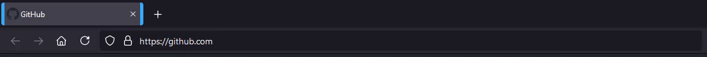

# userchrome.css
Firefox allows users to change its interface using CSS. Let's do that!

### Customizations
The goal of this project is to basically fix small things I didn't really like about the Firefox UI:
* The selected tab does not stand out enough from the others
* The URL bar is a bit cluttered with all buttons displayed

One thing to note is that this theme is for Firefox in dark mode. This probably looks very bad in light mode.

With that in mind, here are the customizations:
* The "container color bar" below the tab is moved to the sides of the tab
  * The currently selected tab has wider borders, which makes it more visible
  * There is an animated border transition when selecting a new tab
* Tabs that are not selected have a slightly less visible font


* The small search bar only displays the arrow button when the mouse is hovering over it (also with a small delay)
* The URL bar buttons are only displayed when hovering over it, with a small delay



* Do not display close buttons on tabs, except for the currently selected tab

### How to use
1. Open Firefox
2. Go to `about:config` and set `toolkit.legacyUserProfileCustomizations.stylesheets` to `true`
3. Visit the `about:profiles` page
4. Open a command prompt / terminal and `cd` to the folder displayed as root directory of the currently selected profile
5. Run this command to download this repo into the `chrome` folder
```sh
git clone https://github.com/xarantolus/userchrome.css.git chrome
```
6. Restart Firefox. The theme should now be applied.

### How to develop
There's a [tutorial on Reddit](https://www.reddit.com/r/FirefoxCSS/comments/73dvty/tutorial_how_to_create_and_livedebug_userchromecss/) on how to edit the Firefox UI like a website using the built-in developer tools.

### License
This is free as in "It's just a stylesheet; just use it, I don't care" software. Do whatever you like with it.
